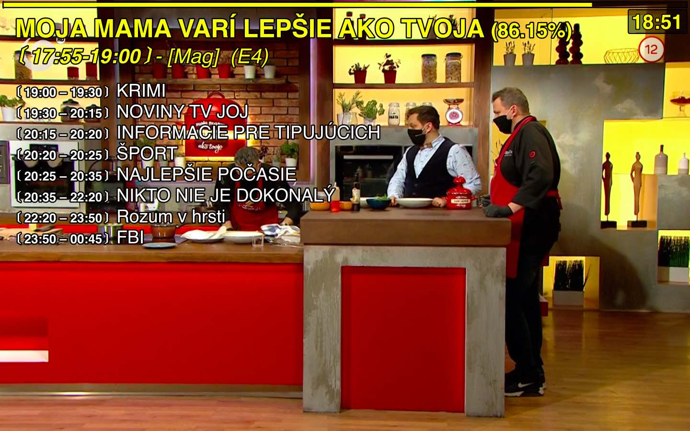

# mpvEPG

Simple EPG information for enigma/dreambox HTTP streams in [mpv](https://mpv.io).

## Screenshot



## Dependency

[SLAXML](https://github.com/Phrogz/SLAXML) - pure-Lua SAX-like streaming XML parser.

You can install slaxml using `luarocks`

```
luarocks install --lua-version 5.1 slaxml
```

## Installing

### Script
mpv reads its configuration from `MPV_HOME` directory. On *nix systems it is
`~/.config/mpv`, see [files](https://mpv.io/manual/stable/#files) section of
the manual for the Windows configuration files.

To install the script, copy `mpvEPG.lua` to the `MPV_HOME/scripts/` directory to load it automatically. Alternatively you can use the `--script=/path/to/mpvEPG.lua` command line option from mpv or you can create profile in your `mpv.conf`

```
[epg]
script=/path/to/mpvEPG.lua
```
and use the `--profile=epg` command line option to use the profile.

### XMLTV data files
By default script searches for XMLTV data files in `MPV_HOME/epg/` directory. You need two files for the script to function:

- `epg.xml` which contains EPG data in XMLTV format
- `channels.xml` which contains satelite bouquet id to channel name mapings

#### XML data samples
**epg.xml**

```xml
<?xml version="1.0" encoding="UTF-8"?>
<tv generator-info-name="Rytec" generator-info-url="https://forums.openpli.org">
  <programme start="20200420175500 +0200" stop="20200420190000 +0200" channel="JOJ.sk">
    <title lang="cs">MOJA MAMA VARÍ LEPŠIE AKO TVOJA</title>
    <sub-title lang="cs">[Mag]  (E4)</sub-title>
    <desc lang="cs">Rodinno-zábavná televízna show nielen o varení. Dve súperiace rodiny si navzájom skrížia varešky a bojujú svojimi "naj receptami", ktoré musia uvariť deti za pomoci svojej mamy či otca.</desc>
  </programme>
</tv>
```
**channels.xml**

```xml
<?xml version="1.0" encoding="utf-8"?>
<channels>
  <channel id="JOJ.sk">1:0:1:3398:C89:3:EB0000:0:0:0:</channel>
  <channel id="JOJ.sk">1:0:19:3398:C89:3:EB0000:0:0:0:</channel>
</channels>
```


## Usage
Press `h` to display EPG, script also listens for `file-loaded` event and automaticaly displays EPG when you switch channel.

## License

This project is licensed under the MIT License - see the [LICENSE.md](LICENSE.md) file for details.